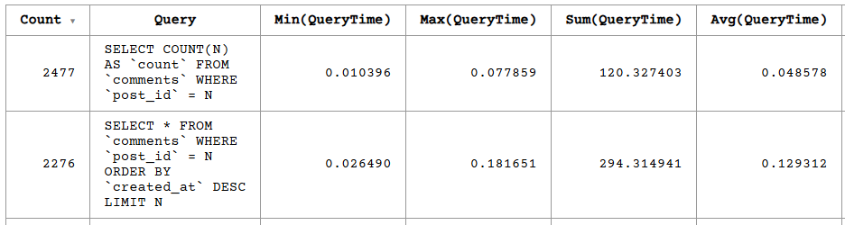
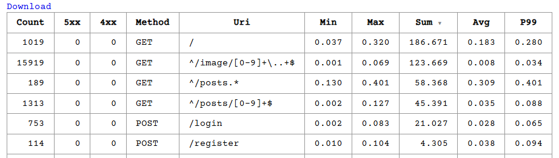
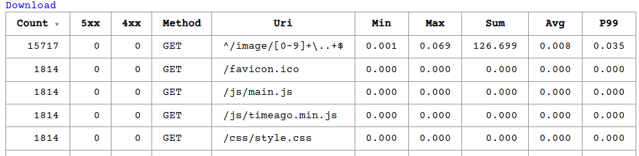
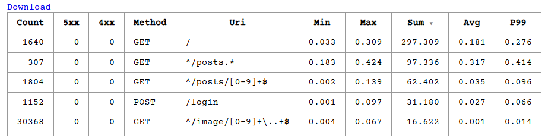
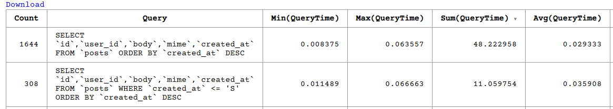
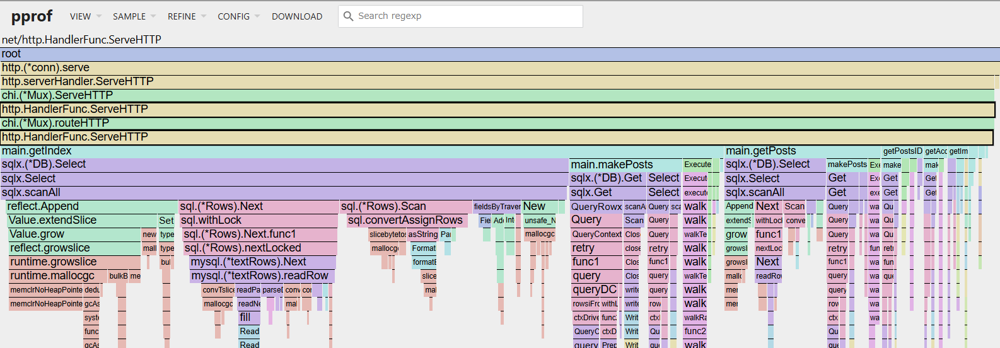

# private-isu-challenge

---

## スコア推移

### 初期スコア
```bash
{"pass":true,"score":4193,"success":4037,"fail":0,"messages":[]}
```


### commentsテーブル idx_post_id_created_at_desc 追加
```bash
$ mysql -u isuconp -pisuconp isuconp -e "alter table comments add index idx_post_id_created_at_desc (post_id, created_at DESC);"
```
```bash
{"pass":true,"score":34720,"success":32646,"fail":0,"messages":[]}
```


### 静的ファイルをキャッシュ
```config
  location ~ .*\.(ico|css|js|img) {
    expires 1d;
    add_header Cache-Control public;
  }
```
```bash
{"pass":true,"score":34846,"success":32802,"fail":0,"messages":[]}
```


### 画像ファイル取得時と同時にすべて書き出す。/image/* にマッチするリクエストを画像ファイルが存在する場合はそのファイルを返す（キャッシュも有効）
- https://github.com/melanmeg/private-isu-challenge/commit/9665894c45f6c09bdfaf2efbc1dd09de8acbf144
- https://github.com/melanmeg/private-isu-challenge/commit/d7053047c2a1fac6ab9f1d6888ee28125f2eca4e
```bash
{"pass":true,"score":54217,"success":51773,"fail":0,"messages":[]}
```




### posts, usersをjoin. LIMIT 20
- https://github.com/melanmeg/private-isu-challenge/commit/bc1662d5c64f324286c2258b1dd07fa670041a9b
```bash
{"pass":true,"score":72393,"success":69147,"fail":0,"messages":[]}
```
```bash
mysql> EXPLAIN
    -> SELECT p.id, p.user_id, p.body, p.mime, p.created_at
    -> FROM posts AS p
    -> JOIN users AS u ON (p.user_id = u.id)
    -> WHERE u.del_flg = 0
    -> ORDER BY p.created_at DESC
    -> LIMIT 20;
+----+-------------+-------+------------+--------+---------------+---------+---------+-------------------+------+----------+----------------+
| id | select_type | table | partitions | type   | possible_keys | key     | key_len | ref               | rows | filtered | Extra          |
+----+-------------+-------+------------+--------+---------------+---------+---------+-------------------+------+----------+----------------+
|  1 | SIMPLE      | p     | NULL       | ALL    | NULL          | NULL    | NULL    | NULL              | 9791 |   100.00 | Using filesort |
|  1 | SIMPLE      | u     | NULL       | eq_ref | PRIMARY       | PRIMARY | 4       | isuconp.p.user_id |    1 |    10.00 | Using where    |
+----+-------------+-------+------------+--------+---------------+---------+---------+-------------------+------+----------+----------------+
2 rows in set, 1 warning (0.00 sec)
```

### commentsテーブル idx_user_id 追加
```bash
$ mysql -u isuconp -pisuconp isuconp -e "alter table comments add index idx_user_id (user_id);"
```
```bash
```

### postsテーブル idx_created_at_desc 追加. force indexを追加.
```bash
# メモ) ここで以下のようなクエリが上位にくるはず
SELECT p.id, p.user_id, p.body, p.mime, p.created_at, u.account_name
FROM posts AS p
JOIN users AS u
ON (p.user_id = u.id)
WHERE p.user_id ='85'
AND u.del_flg = 0
ORDER BY p.created_at
DESC LIMIT 20
```
```bash
$ mysql -u isuconp -pisuconp isuconp -e "alter table posts add index idx_created_at_desc (created_at DESC);"
```
```bash
```

---

## 環境構築
- https://gist.github.com/melanmeg/41e5f575b494ca83b7ca8ba76c91cd05

> pproteinとphpmyadminの用意
- https://gist.github.com/melanmeg/d90533425d32b87f16b695667b8de141

- 初期設定
```bash
# SSH後に実行
$ cd ~ && \
  git clone https://github.com/melanmeg/private-isu-challenge.git && \
  mv private_isu private_isu.bk && \
  mv private-isu-challenge private_isu && \
  ssh-keygen -t ed25519 -C "" -f ~/.ssh/id_ed25519 -N "" && \
  sudo apt update -y

# private-isuでGOROOT空だったので、そのような場合にGoをインストールする
$ sudo rm -rf /usr/local/go
$ TAR_FILENAME=$(curl 'https://go.dev/dl/?mode=json' | jq -r '.[0].files[] | select(.os == "linux" and .arch == "amd64" and .kind == "archive") | .filename')
$ URL="https://go.dev/dl/$TAR_FILENAME"
$ curl -fsSL "$URL" -o /tmp/go.tar.gz && \
  sudo tar -C /usr/local -xzf /tmp/go.tar.gz && \
  rm -f /tmp/go.tar.gz
$ cat <<EOF >> ~/.bashrc
export GOROOT=/usr/local/go
export GOPATH=$HOME/go
EOF
```

---

## 参考
- [kazeburo/private-isu-challenge](https://github.com/kazeburo/private-isu-challenge)
- [kaz/pprotein](https://github.com/kaz/pprotein)
- [ISUCON12で2位になりました(織時屋)](https://trap.jp/post/1710/)
- [ISUCON12で優勝しました(チーム NaruseJun)](https://zenn.dev/tohutohu/articles/8c34d1187e1b21)
- [ISUCON13で優勝しました(チーム NaruseJun)](https://zenn.dev/tohutohu/articles/923bdf5dcd73af)
- [ISUCON9予選1日目で最高スコアを出しました](https://to-hutohu.com/2019/09/09/isucon9-qual/#%E5%BD%93%E6%97%A5)
- nwiizoさん, megumishさん 参考リンク
  - [ISUCON8 本戦に出てまあまあだった話](https://hikalium.hatenablog.jp/entry/2018/10/20/225806)
  - [自分のチームのISUCONでの戦い方](https://catatsuy.medium.com/%E8%87%AA%E5%88%86%E3%81%AE%E3%83%81%E3%83%BC%E3%83%A0%E3%81%AEisucon%E3%81%A7%E3%81%AE%E6%88%A6%E3%81%84%E6%96%B9-c8fe121316aa)
  - [ISUCON 夏祭り 2023 ハンズオン資料](https://speakerdeck.com/rosylilly/isucon-xia-ji-ri-2023-hanzuonzi-liao)
